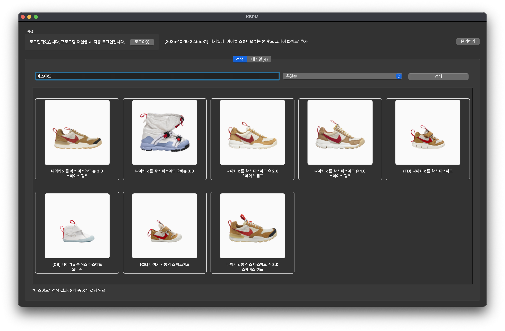
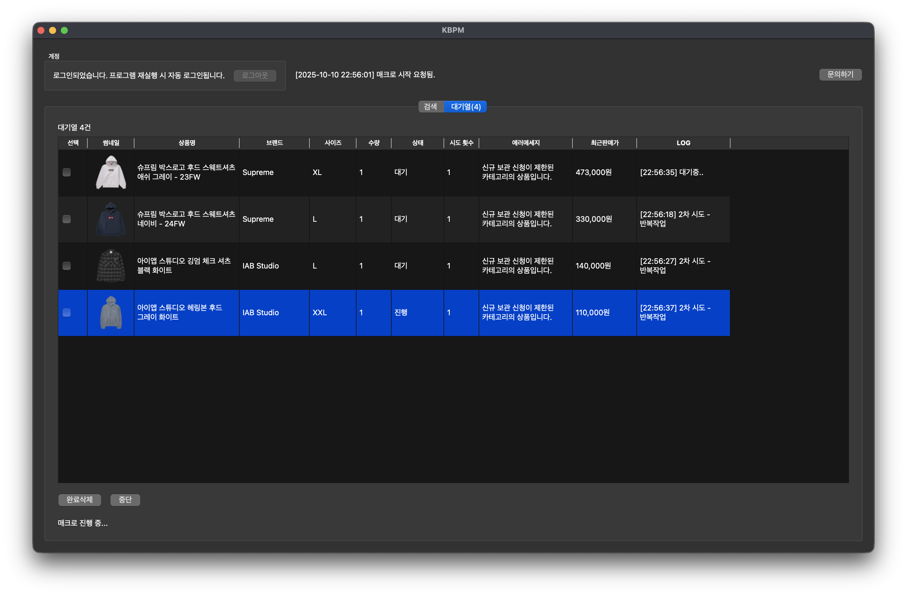

# KBPM

**KREAM 보관 판매 매니저 (KREAM Booking Product Manager)**

## 사용 방법

1. 로그인 버튼으로 KREAM 계정을 인증합니다.

2. 검색창에 상품명을 입력하고 **검색**을 누릅니다.

3. 결과에서 원하는 상품을 더블 클릭하여 사이즈/수량을 선택하면 대기열에 추가됩니다.

4. 대기열 탭에서 상태를 확인하고 **매크로 시작**으로 보관판매를 진행합니다.

5. 도구 메뉴에서 브라우저를 초기화하거나 로그 수준을 변경할 수 있습니다.

## 개발자 후원하기

**개발자에게 후원하여 프로그램 개선에 도움을 주세요!**

## 참고 사항

- 프로그램 실행 시 KREAM 계정과 Chrome 브라우저 설치가 필요합니다.
- 이 프로그램은 서버를 거치지 않고 로컬에서 실행됩니다. 즉, 개발자가 사용자의 계정 정보를 알 수 없습니다.
- 크롬 브라우저가 설치되어 있지 않으면 로그인 기능이 작동하지 않습니다. 반드시 크롬 브라우저를 설치하세요.
- 윈도우 버전은 따로 설치가 필요 없습니다.
- 맥 버전은 ARM 기반과 Intel 기반에 맞는 파일을 사용하세요.
- KREAM의 정책 변경에 따라 작동이 중단될 수 있습니다.
- 이 도구는 KREAM과 무관하며, 사용에 따른 모든 책임은 사용자에게 있습니다.
- 크림 사업자 계정은 지원하지 않습니다.

## KBPM 다운로드 (v1.0.9 | 2025-11-10)

[Windows EXE](docs/downloads/KBPM.exe)

[macOS DMG (Apple Silicon)](docs/downloads/KBPM-macOS-arm64.dmg)

[macOS DMG (Intel)](docs/downloads/KBPM-macOS-intel.dmg)

_Made with 📦 by [@missiletoe](https://github.com/missiletoe)_
